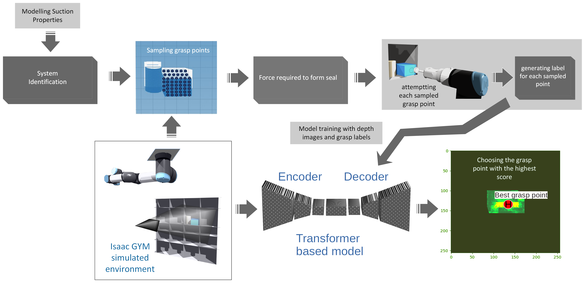

# UW+Amazon Science HUB's DYNAMO GRASP Package

Welcome to the documentation for DYNAMO GRASP! Here, you will find all the necessary information to get started, use, and contribute to the project.

DYNAMO GRASP introduces a novel approach to suction grasp point detection, combining physics-based simulation and data-driven modeling to enhance a robot's grasping capabilities. This method, proven through comprehensive evaluations, demonstrates remarkable adaptability to complex and unexpected object dynamics, offering robust generalization to real-world challenges.

## Pipeline Overview




```{note}
For more information on the research overview and results, visit [our project page](https://sites.google.com/view/dynamo-grasp). <br/>
For source code, visit our [GitHub repository](https://github.com/bolingy/grasp-point-selection-sim.git).

```
## Table Contents

 - [Publication](publications.md) <br/>
 - [Installation](installation.md) <br/>
 - [Getting Started](usage.md) <br/>
 - [Dataset](dataset.md) <br/>
 - [Training](training.md) <br/>
 - [License](license.md) <br/>


```{toctree}
:caption: Publications
:hidden:

publications.md

```

```{toctree}
:caption: Setup Instructions
:hidden:

installation.md
usage.md

```

```{toctree}
:caption: Dataset Information
:hidden:

dataset.md

```

```{toctree}
:caption: Training models
:hidden:

training.md

```

```{toctree}
:caption: License Information
:hidden:

license.md

```